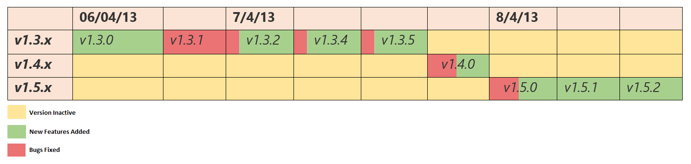

# Report 1 - ESOF

## Authors

* Diana Isabel Garcia Pinto
* João Henrique Poceiro Vieira de Araújo
* Luís Filipe Rodrigues Coelho
* Marisa Daniela Quintal Oliveira

---
### Abstract
In the context of the subject ESOF we intend to analyze the software processes used by ...
Regarding the software process we will be going over on how the different typical phases of most process models are/were handled by the developers followed by an analysis of which models best fit what they have been doing.

---

###Introduction
RedReader is an open source mobile app available in Android and IOS. Known by “unofficial, open source cliente for reddit”, already have 50.000 downloads on playStore. Launched in 2013, version 1.3.0, it come a long way till this current version available, 1.9.6. Its principal featuras are:
*	Free and Open Source Software - no ads/tracking.
*	Lightweight and fast
*	Downloads are compressed to save bandwidth.
*	Support for multiple accounts.
*	Several themes such as Night mode (i.e. dark theme) and Holo
*	Swipe posts left and right to perform customisable actions, such as upvote/downvote, or save/hide.
*	Advanced cache management - automatically stores past versions of posts and comments.
*	Two-column tablet mode (can be used on your phone, if it's big enough)
*	Image and comment precaching (optional: always, never, or Wi-Fi only).
*	Built-in image viewer, imgur album viewer, GIF player, and webm/mp4/gifv player.

### Project structure

####Release Schedule
RedReader is an open source project developed (most of all) by one contributor. When there is another contributor, doing some new features or fixing bugs, if he decided to do pull request, the main contributor decides if the new feature or bug fix should be merged. It doesn’t follow any particular Realese Schedule, most of the time, new versions appear when there’s some bugs to fix or new features to add. The following two tables are data collected about the appearance of new versions (the first versions and the last versions).

_First Versions Released_

_Last Versions Released_

Looking at the first table we found that initially, very close to the beginning of the launch of the first version of this project, several changes were released from the same version on the same day and even multiple versions have been released in a short time (from day to day) due to suggestions that emerged from the users and even to correct some bugs detected.

Now Looking at the second table, things get better. The new versions don't come out every day to release a new feature or fix some bugs and that's due to the Alpha versions. Alpha versions allow contibutors to add new features there without creating a new version of ReadReader, instead, they create a new Alpha version with the new feature, in order to not change the actual version of the app several times. Users are invited to test the new Alpha versions, to try the new features and report bugs. Once the Alpha version is stable and big enough to create a new version it is released.

####Release Branches

Redreader is a incremental development application that allows developer to take advantage of what have learned during inicial phase and beyond that, suffers updates in a way that application will keep attractive and innovative to the user.
Is constantly releasing new versions. The developer tried using branches for the development of the application, but was not good succeed, so opted to stay only to develop in the branch master. The suggestions given by users and application bug fixes are only developed in a continuous and gradual in the master branch.

####Release Cycle

There doesn't seem to be a defined time of release for each new version of the application. Over the past year, the time intervals between major releases ranged from one to four months. If necessary, there may be a couple of minor updates between releases, mostly with bug fixes. Since there is only one main developer, the release cycle will ultimately depend on his code frequency and on the number of contributors actively helping during that time frame. 

After a new version has been released and to avoid having to release a new one shortly after, any new implemented functionalities can be tested in the Alpha version by users and contributors alike.

---
